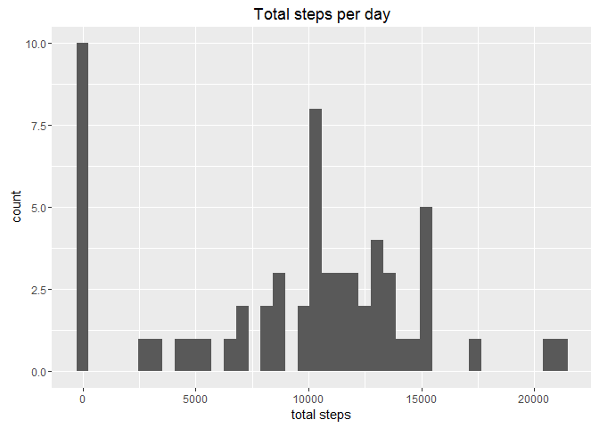
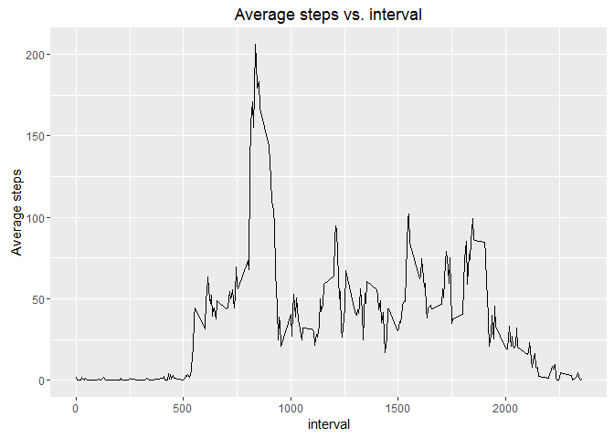
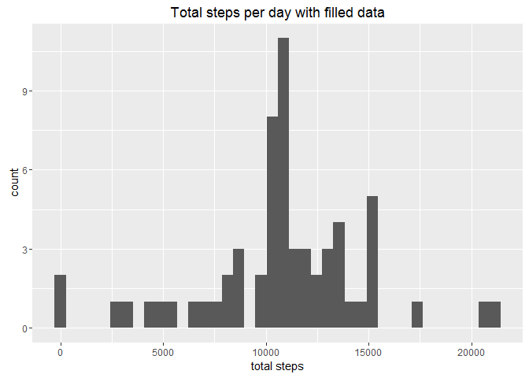
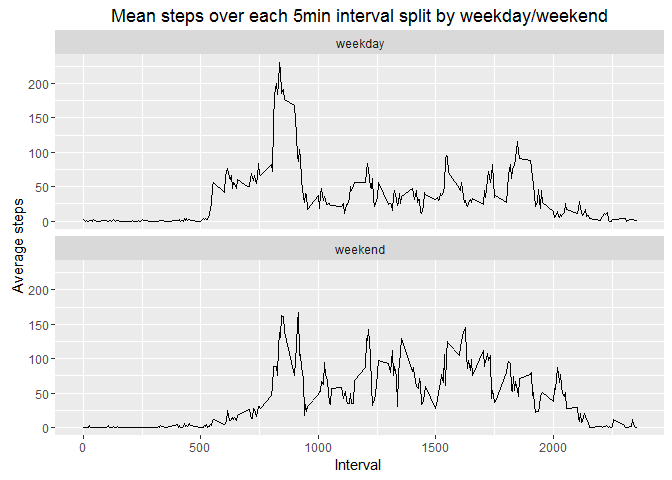

# Reproducible Research: Peer Assessment 1

## Loading and preprocessing the data

Read data file using read.csv() function, then convert to data table.


```r
library(data.table)
library(ggplot2)
library(plyr)
library(dplyr)
```

```
## -------------------------------------------------------------------------
```

```
## data.table + dplyr code now lives in dtplyr.
## Please library(dtplyr)!
```

```
## -------------------------------------------------------------------------
```

```
## 
## Attaching package: 'dplyr'
```

```
## The following objects are masked from 'package:plyr':
## 
##     arrange, count, desc, failwith, id, mutate, rename, summarise,
##     summarize
```

```
## The following objects are masked from 'package:data.table':
## 
##     between, last
```

```
## The following objects are masked from 'package:stats':
## 
##     filter, lag
```

```
## The following objects are masked from 'package:base':
## 
##     intersect, setdiff, setequal, union
```

```r
dt_act<-data.table(read.csv("activity.csv"))
```

## What is mean total number of steps taken per day?


First we calculate the total number of steps per day, then get the summary of the totoal steps.

```r
dt_totalsteps<-dt_act[,sum(steps,na.rm = TRUE),by=date]

names(dt_totalsteps)<-c("date","total_steps")

data_summary<-summary(dt_totalsteps$total_steps)
print(data_summary)
```

```
##    Min. 1st Qu.  Median    Mean 3rd Qu.    Max. 
##       0    6778   10400    9354   12810   21190
```
The mean value of total steps per day is 9354 and the median value of total  steps per day is 10400


Here is the histogram of total steps per day with bins=40:


```r
hist_totalsteps<-ggplot(data=dt_totalsteps,aes(total_steps))
hist_totalsteps<-hist_totalsteps+geom_histogram(bins = 40)+xlab("total steps")
hist_totalsteps<-hist_totalsteps+ggtitle("Total steps per day")
print(hist_totalsteps)
```

<!-- -->

## What is the average daily activity pattern?

We first calculate the average number of steps vs. interval, then plot the time series plot of the 5-minute interval and the average number of steps taken across all days.


```r
dt_act[,step_mean:=mean(steps,na.rm=TRUE),by=interval]
```

```
##        steps       date interval step_mean
##     1:    NA 2012-10-01        0 1.7169811
##     2:    NA 2012-10-01        5 0.3396226
##     3:    NA 2012-10-01       10 0.1320755
##     4:    NA 2012-10-01       15 0.1509434
##     5:    NA 2012-10-01       20 0.0754717
##    ---                                    
## 17564:    NA 2012-11-30     2335 4.6981132
## 17565:    NA 2012-11-30     2340 3.3018868
## 17566:    NA 2012-11-30     2345 0.6415094
## 17567:    NA 2012-11-30     2350 0.2264151
## 17568:    NA 2012-11-30     2355 1.0754717
```

```r
g<-ggplot(data=dt_act,aes(interval,step_mean))
g<-g+geom_line()+ylab("Average steps")+ggtitle("Average steps vs. interval")
print(g)
```

<!-- -->

Then we calculate the maximum number of steps averaged across all the days:

```r
print(c(max(dt_act$step_mean),dt_act$interval[which.max(dt_act$step_mean)]))
```

```
## [1] 206.1698 835.0000
```

The maximum number is 206.1698113 and the 5 minute inverval with this maximum number is 835

## Imputing missing values

The total number of missing value in the data set is 2304 . 

Here we use the mean value of steps to replace the "NA" missing value in steps, and saving the original steps value into "old_steps".

A new dataset "dt_new_act" is created. It is equal to the original dataset but with the missing data filled in.


```r
dt_act[,old_steps:=steps]

dt_act[,steps:=replace(steps,is.na(steps),step_mean)]

dt_new_act<-select(dt_act,steps,date,interval)
```

We calculate the total steps in the the new data set "dt_new_act" per day and plot the histogram 


```r
dt_new_totalsteps<-dt_new_act[,sum(steps),by=date]
names(dt_new_totalsteps)<-c("date","new_total_steps")


data_summary_2<-summary(dt_new_totalsteps$new_total_steps)
print(data_summary_2)
```

```
##    Min. 1st Qu.  Median    Mean 3rd Qu.    Max. 
##      41    9819   10770   10770   12810   21190
```

```r
hist_new_totalsteps<-ggplot(data=dt_new_totalsteps,aes(new_total_steps))
hist_new_totalsteps<-hist_new_totalsteps+geom_histogram(bins=40)+xlab("total steps")+ggtitle("Total steps per day with filled data")
print(hist_new_totalsteps)
```

<!-- -->

The mean value of total steps per day is 10770 and the median value of total  steps per day is 10770. the difference between those values comparing with first part is 1416 and 370. The filled data increased bothe the mean value and the median value.


## Are there differences in activity patterns between weekdays and weekends?

First we split teh data from weekdays and weekends.


```r
allweekdays= c("Monday","Tuesday","Wednesday","Thursday","Friday")

dt_new_act$weekday<-as.factor(ifelse(weekdays(as.Date(dt_new_act$date))%in%allweekdays,"weekday","weekend"))

weekdaysplit<-ddply(dt_new_act, c("interval","weekday"),summarise,
                                     meansteps = mean(steps,na.rm=TRUE)
)

weekdayplot<-ggplot(weekdaysplit,aes(x=interval,y=meansteps))+
       facet_wrap(~weekday,nrow=2,ncol=1)+ geom_line()
 weekdayplot<-weekdayplot+ ggtitle("Mean steps over each 5min interval split by weekday/weekend")+ylab("Average steps")+ xlab("Interval ")
print(weekdayplot)
```

<!-- -->

So in weekends, the activity is higher in weekedn that in weekday after 1000 intervals 
