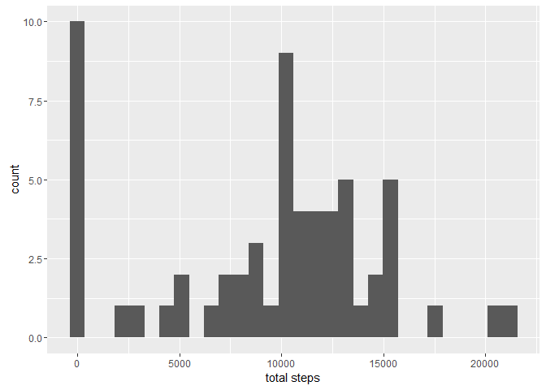
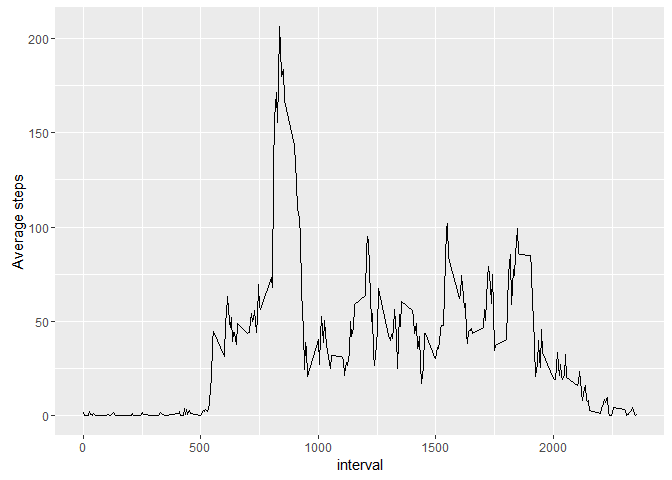

# Reproducible Research: Peer Assessment 1

## Loading and preprocessing the data


```r
library(data.table)
library(ggplot2)

dt_act<-data.table(read.csv("activity.csv"))

dt_totalsteps<-dt_act[,sum(steps,na.rm = TRUE),by=date]

names(dt_totalsteps)<-c("date","total_steps")
```

## What is mean total number of steps taken per day?


```r
data_summary<-summary(dt_totalsteps$total_steps)
print(data_summary)
```

```
##    Min. 1st Qu.  Median    Mean 3rd Qu.    Max. 
##       0    6778   10400    9354   12810   21190
```

## What is the average daily activity pattern?


```r
hist_totalsteps<-ggplot(data=dt_totalsteps,aes(total_steps))
hist_totalsteps<-hist_totalsteps+geom_histogram()+xlab("total steps")
print(hist_totalsteps)
```

```
## `stat_bin()` using `bins = 30`. Pick better value with `binwidth`.
```

<!-- -->

```r
dt_act[,step_mean:=mean(steps,na.rm=TRUE),by=interval]
```

```
##        steps       date interval step_mean
##     1:    NA 2012-10-01        0 1.7169811
##     2:    NA 2012-10-01        5 0.3396226
##     3:    NA 2012-10-01       10 0.1320755
##     4:    NA 2012-10-01       15 0.1509434
##     5:    NA 2012-10-01       20 0.0754717
##    ---                                    
## 17564:    NA 2012-11-30     2335 4.6981132
## 17565:    NA 2012-11-30     2340 3.3018868
## 17566:    NA 2012-11-30     2345 0.6415094
## 17567:    NA 2012-11-30     2350 0.2264151
## 17568:    NA 2012-11-30     2355 1.0754717
```

```r
g<-ggplot(data=dt_act,aes(interval,step_mean))
g<-g+geom_line()+ylab("Average steps")
print(g)
```

<!-- -->


## Imputing missing values


```r
dt_act[,old_steps:=steps]

dt_act[,steps:=replace(steps,is.na(steps),step_mean)]
```

## Are there differences in activity patterns between weekdays and weekends?
